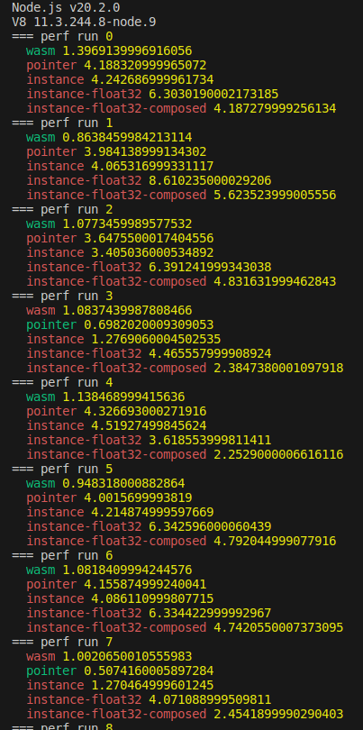
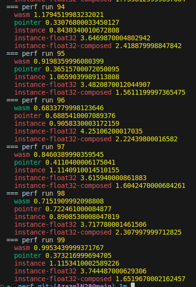

# Performance benchmarks

## Differences between benchmarks

- `test.js` has a deep nested pointer structure while `test-plain.js` uses a flat structure.

| File                 | WASM | Pointer | Object |
|:---------------------|:-----|:--------|:-------|
| test-plain.js        | ✗    | ✔️       | ✔️      |
| test-wasm-plain.js   | ✔️    | ✔️       | ✔️      |
| test-wasm.mjs        | ✔️    | ✗       | ✗      |
| test.js              | ✗    | ✔️       | ✔️      |

## How to compile

```sh
make
```

## How to run

```sh
node test-wasm-plain.js 100 100000
```

The first parameter is the number of runs (the number of times the benchmark is executed).

## Results

In the first runs, `WebAssembly` wins because it is already "compiled" and "optimized".



After a few runs, natively accessing a compact linear memory wins.


